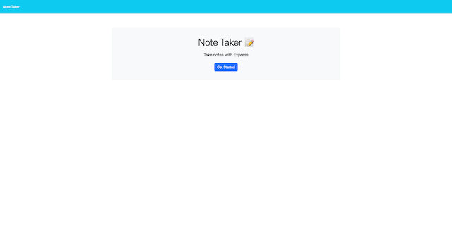
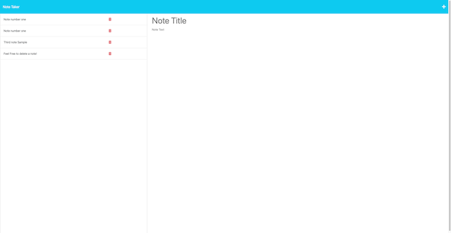

# Note Taker

  

  ## Description:
        
  A persistent FullStack App hosted on Heroku that allows you to create, read, and delete notes.
    
  ---

  ## Deployed Project / Repo:
  - [Link to Deployed Project](https://hidden-badlands-10348.herokuapp.com/)
  - [Link to GitHub Repository](https://github.com/Jamesgit22/Note-Taker)
  
  ## Table of Contents:
    
  - [Instillation](#instillation)
  - [Usage](#usage)
  - [Credits](#credits)
  - [License](#license)
  - [Questions](#questions)
  
  ## Instillation:
  
  You can use this project in your browser by clicking [here](https://hidden-badlands-10348.herokuapp.com). If you would like to use the codebase, please clone down from the [github repo](https://github.com/Jamesgit22/Note-Taker) to a local code editor.
  
  ## Usage:
  
  This app could be used as a resource to quickly write and store any notes or ideas to a persistent database. You could then delete the notes once you no longer need them.
  
  ## ScreenShots:
  

  ---

  

  ---

  
  
  ## Credits:
  
  Third-party Assets: 
  - Node.js
  - Express
  - Heroku
  - Assistance provided by John Dinsmore
  - Helper functions located in "helpers" folder
  
  ## License:
  
  This project is covered under the [MIT](https://opensource.org/licenses/MIT) license.

  ---
  
  ## Questions:

  Please feel free to get in contact if you have any questions about this project.

  - Github: [jamesgit22](https://github.com/jamesgit22)
  - Email: jamesschroedermail97@gmail.com